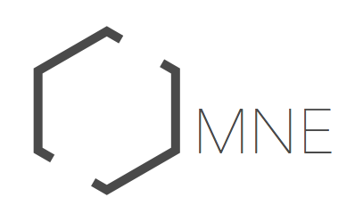

OMNE is a tool for creative table-top players who want to design and experience immersive worlds. The systems allows for the rapid production of everything from tools to races to mobs, with the goal that an entire world, complete with playable characters, can be devised within an afternoon.

Watch this repo for updates and invitations to playtesting sessions.
