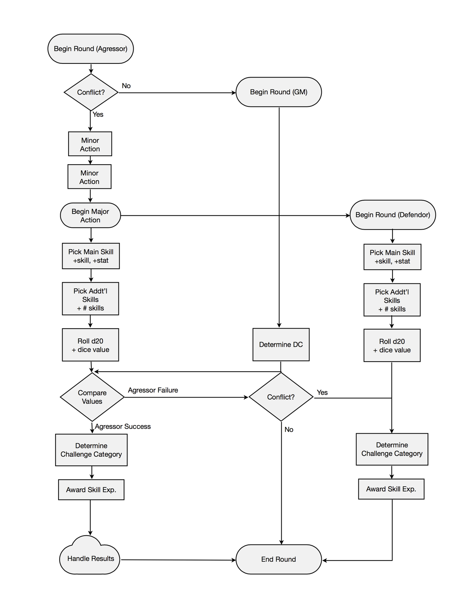
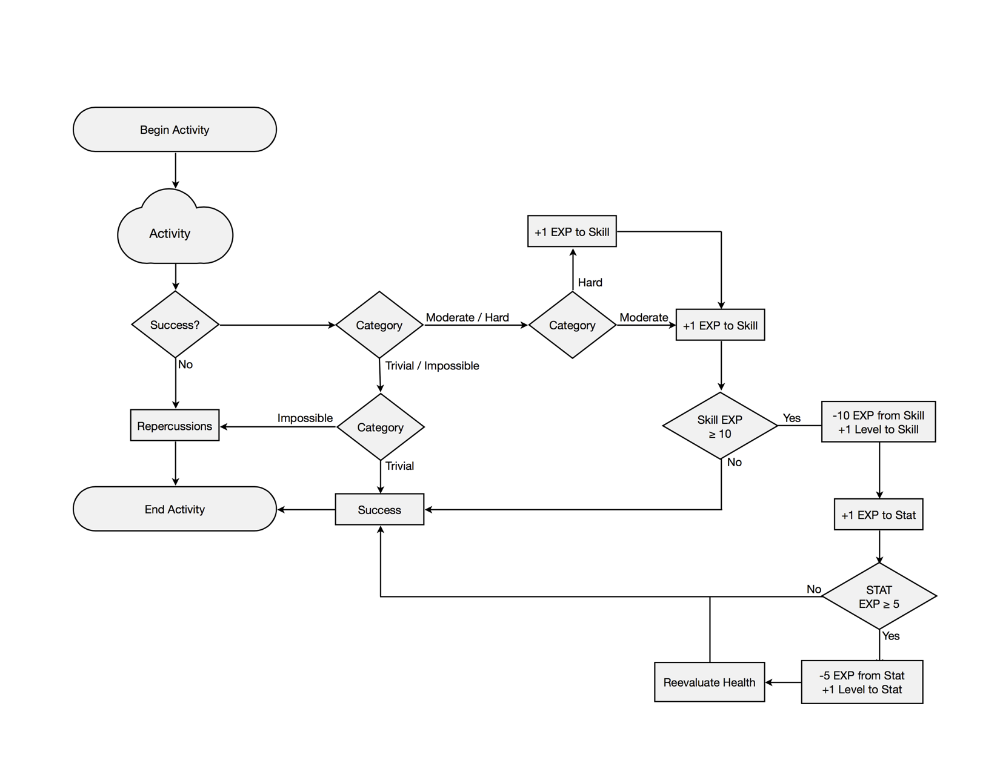

# Intro

## What is OMNE?

OMNE is a tool for creative table-top players who want to design and experience immersive worlds. The systems allows for the rapid production of everything from tools to races to mobs, with the goal that an entire world, complete with playable characters, can be devised in an afternoon.

## Why can’t I just use [GURPS](http://www.sjgames.com/gurps/) or re-skin D&D?

You can, if you’d like. Both systems bring something entirely different to the table, and they might be what you're looking for. However, re-skinning D&D can be a tedious process, and because the rules are designed with the D&D universe in mind, some of the crucial detail often gets lost in translation. And unlike GURPS&mdash;which is also a system meant to support user-created worlds&mdash;OMNE’s approach is one of prototyping.

## How do I start?

You'll need a few simple things that you probably already have if you play tabletop RPGs.

### Materials

- Standard `d20` dice set
- Writing implement
- Character sheet
- GM-provided resources

Then, if you're planning on Game Mastering (GM’ing) your group's OMNE experience, head over to the [GM guide](./GM-Guide.md). The GM Guide will help you generate your world and make it fit the OMNE purview.

If you're playing, but you're not planning to run a game right now, move on to **How do I make a character?**, and start thinking about what you want to do in your GM’s world.

# Basics 

## How do I make a character? 

So you want to know how to make a character; but before you can do that you need to know what a character consists of. In OMNE, like most other table-top systems, a character is addressed as a sum of several attributes (called “stats” in OMNE) and abilities (called “skills” in OMNE). The stats are a method of addressing the physical and mental capabilities inherent to a character, while the skills are a measurement of a character’s practiced capabilities.

In OMNE, the list of stats (known as an 8.2 stat system[1](#1_stat_system)) breaks down like this:

### Physical (PHYS)
|     Stat     |    Abbr.  | Definition                              |
|:------------:|:---------:|:----------------------------------------|
|   Strength   |    STRN   | Physical power                          |
|   Dexterity  |    DEXT   | Skill with prehensile appendages        |
|    Agility   |    AGIL   | Moving quickly and easily               |
|    Stamina   |    STAM   | Sustained physical effort               |
| *Visibility* |   *VSBL*  | *Visibility to the outside world*       |

### Mental (MNTL)
|     Stat     |    Abbr.  | Definition                              |
|:------------:|:---------:|:----------------------------------------|
|   Intellect  |    INTL   | Mental power                            |
|  Creativity  |    CRTV   | Generation of original ideas            |
|   Charisma   |    CHAR   | Social skills which inspire emotion     |
|     Zeal     |    ZEAL   | Mental fortitude, intuition, and belief |
| *Perception* |   *PRCP*  | *Awareness of surroundings*             |

  
Overall, these stats provide the basis for a character’s more specific skills, as well as their capacity for health and wellbeing. In OMNE, skills are not quite as succinct as stats. A skill is anything a being can attempt. Anything. Ever. Common skills for a D&D-style adventurer might include Dodge, Swordplay, Block, Lockpicking, and Tracking. Common skills for a 29th century robot might include Lasers, Mapping, Hacking, and Dodge. And common skills for a modern day chef might include Knifework, Chemistry, Nutrition, Culinary Artistry, and Bowling. In OMNE, skills are the primary way a character interacts with the world. Unlike D&D where skills, combat, and magic are all different systems, OMNE uses skills universally.

But you’ll learn more about that later. For now, the next few bits are all about rolling dice and writing stories; the important (read: only) parts to actually making a character.

<small>
    1. The stat system is known as “8.2” (as opposed to “10” or some similar monicker) because 8 of the stats are active and meliorable. Changes in these stats reflect character growth. Contrariwise, 2 of the stats (*VSBL*, *PRCP*) are static and inherent. These stats are used primarily by the GM to tests a character’s natural effectiveness in certain passive activities, and changes to them reflect drastic or traumatic events.
</small>

## That’s cool and all, but you never told me how to make a character. 

Right, right. Now that you understand what a character is, you can start making one. The first thing to do is pick a race. Your GM did hand you a few races to chose from, right? No? Ok, well, it’s not a big deal&mdash;we’ll just skip that part for now. The first thing to do is pick up a `d4` so you can roll up your stats.

For each individual stat (10 of them) you’ll need to roll `1d4 - 1d4`. That means that your starting level for each stat will be somewhere between `-3` and `3`. For example, if you roll a 4 and a 2, you would have a score of 4 - 2 = 2. Or you might roll a 1 and a 2, for a score of 1 - 2 = -1.

Once you have 10 of these numbers, go ahead and assign each one to a stat (and if your GM has finally gotten around to giving you some races, pick one and apply the necessary modifiers). Assuming you’re playing, say, a Human, your stats might now look something like this:

|   PHYS   | Level |   MNTL   | Level |
|:--------:|------:|:--------:|------:|
|   STRN   |    -1 |   INTL   |     3 |
|   DEXT   |     0 |   CRTV   |     3 |
|   AGIL   |     2 |   CHAR   |     0 |
|   STAM   |    -1 |   ZEAL   |     1 |
|  *VSBL*  |     0 |  *PRCP*  |     1 |

  
Once you’ve done that, go ahead and calculate your Health Points (HP), using this equation:

|     Health Equation      |     Health Regeneration    |
|:------------------------:|:--------------------------:|
|   `(2 * STAM) + 20`      |       `ZEAL / hour`        |
| <small>minimum 1</small> |  <small>minimum 0</small>  |
|        &nbsp;            | <small>resting, x2</small> |

  
That equation is how you determine health through the game: ergo, if your STAM goes up by 1, your HP goes up by 2.

Next, write a backstory. Make it as detailed or vague as you’d like. Cover a broad variety of pertinent factoids, or simply state your name and occupation. Keep in mind, though, that your GM will be using this to determine your starting skill set and skill levels&mdash;so it's very much to your benefit to create a detailed description. Then, hand off your character to your glorious leader. They will be responsible for determining what your character is initially capable of and what tools they will have on hand. The GM does this by determining either (a) your character’s full skill set and initial levels, or (b) your character's full skill set and a pool of level points, which you can distribute among your skills as you choose. Note that this does not grant the GM total control over your character. In OMNE, much of the game is determined not by endless tomes of rules, but by a few basic guidelines and the dialogue held between the GM and the players.

It should be safe to assume that, while you were reading that caveat, your GM finished their job, and you’re now ready to move on. What’s that? You have a few more questions? Ok, shoot.

## Does my character level?

Although the final say always comes down to player agreement, OMNE does not provide infrastructure for leveling. Instead, character advancement is handled by way of practicing skills, which in turn sharpens the character’s core stats. More on this later.

## Does my character have a class?

OMNE does not directly handle classes (opting instead for an “anyone-can-do- anything” philosophy), but classes can easily be built on top of OMNE by pre- determining a set of skills relevant to each class (as well as any bonuses, limitations, and weapon/armor capabilities the GM decides are relevant).

## Is there magic in OMNE?

That depends on your GM’s world. If you managed to drag yourself through [Defining Rituals](./GM-Guide.md#defining_rituals), you're already aware that OMNE has a loose framework for supporting all forms of magic, spirituality, science, etc&mdash;basically anything less concrete than swords and stones). If your world takes advantage of any these systems, your character will probably make use of them by practicing skill-based invocations called "rituals". For example, in a classic fantasy world, a character might have the skill **Magic Missile**, which fires a volley of arcane energy, doing damage. This skill would be used identically to any other skill, and you probably won't have to rely on Magic Points, Spells per Day, or any other pool-based system in order to fireball that monster. Rituals, like everything else in OMNE, are treated as skills.

## Does my character have a “to-hit”? Or an Armor Class? Or any perks?

Nope. As previously stated, most everything in OMNE is treaded as a skill. (Remember the key mnemonic **SCREAM**: Skill Checks Rule Everything Around Me.) Ergo, your “to-hit” would just be something like a Swordplay check. Your Armor Class would be something like a Block or Dodge check. And if you’re looking for a perk that gives you berserker-like rage, you’d start practicing Rage and Brawling skills.

## So... There’s no AC... No perks. No separate magic system. How do I do things?

Right. Good question. With a good answer: skills.

## ... ... How do skills work?

As previously mentioned, skills in OMNE are the primary way a character interacts with the world. Skills have a number (score) that measures a character’s capability in that skill. Any skill for any character begins at 0 (unless accounted for in a backstory). Skills correspond to stats, which reflect the relevant core abilities of the character. For example, a typical Dodge skill would correspond to Agility (AGIL), Lockpicking and Piano would both correspond to Dexterity (DEXT), and so on.

## How do I use skills?

Alright, so this is the part where OMNE starts to get a little dense&mdash;and what better way to deal with that than flowcharts? The image below describes how you use skills, which gets a bit complicated considering the universality of OMNE skills. Here’s the overview: if you want your character to attempt something, you make a skill check. That check will be opposed either by a GM-determined Difficulty Check (DC), or an opposing skill check made by another character. This mechanic is used every time your character needs to actively interact with the world. Ready for that flowchart? No? Cool. Here you go:

<small>
So, that was probably miserably unclear. Sorry. As this document gets reviewed by people who are maybe less technically inclined, this section will be used for further explanation. In the mean time, you totally (should) know how do everything in OMNE!
</small>

## Can I critically succeed?

In OMNE, all critical outcomes are the result of an active role-play process. In this process, you must explicitly state your desired target (for example, an enemy’s heart). You then roll as per that awesome flowchart, like any generic skill check. If you succeed, your GM will then compare your roll against a DC to determine if you’ve critically succeeded. This number will usually be higher (possibly even prohibitively so), but failure to critically succeed has no bearing on overall success and experience.

## You never finished “Does my character level?”.

Whoops, damn. No, your character does not level. Remember how OMNE deals with everything through skills? Yep, even this. Actually, there’s probably a flowchart around here somewhere. Regardless, “leveling” in OMNE is basically a process of getting better at, well, life. As you practice skills, the difficulty of everything your character tries to do will fall into 1 of 4 categories:

|  Category  |     Roll Range    |
|:----------:|:-----------------:|
|   Trivial  |     `roll ≤ 1`    |
|  Moderate  |   `1 < roll ≤ 12` |
|    Hard    |  `12 < roll ≤ 20` |
| Impossible |    `roll > 20`    |

  
These categories are broken down by “roll range”. In order to determine roll range, you first need to figure out what number you need to get on your `d20` roll in order to succeed in a skill check.

To do this, calculate the minimum score you can get in your attempt (`STAT + SKILL + # SKILLS`), (where `# SKILLS` is the number of supporting skills you’re using). Then subtract this number from the `DC` (`DC-MIN`). This number is your roll range. An example? Sure:

> You: “I’m going to try and pick the lock.”
>
> > *You then roll a `d20` (`15`), and add your DEXT (`0`) and Lockpicking (`3`). Finally, you add one extra point because you're applying your supporting skill of Locksmithing.*
>
> > *Your total is `19`.*
>
>
> GM: “You succeed, the lock clicks open revealing...”
>
> > *The DC was `13`. Your minimum score was `DEXT + Lockpicking + 1 for Locksmithing` (`4`).*
>
> > *`13 - 4 = 9`. `1 < 9 ≤ 12`. This lock was of moderate difficulty.*
>
>
> GM: “You get 1 experience point in Lockpicking.”

As you succeed at moderate or harder tasks, you are exercising that skill, and therefore getting better. And as you get better at one stat-based skill, you get better at that overall stat. It’s all here in this flowchart.

## Is there anything else I should know before playing?

Yep, there are a few things. These things are still pretty fluid, and will find a better home than “Miscellaneous” by the final version of the booklet. Nevertheless, here they are:

- There will eventually be a point-buy system that can be used instead of the `d4 - d4` process in the near future.
- This document is currently in alpha, so please fork and make changes, participate in playtests, and generally help out as much as you'd like!
