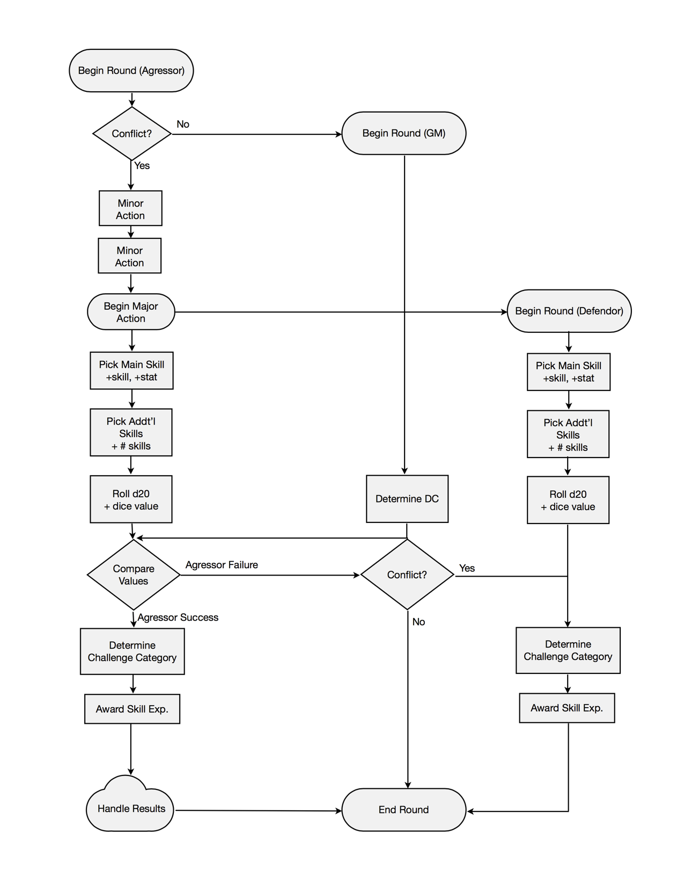
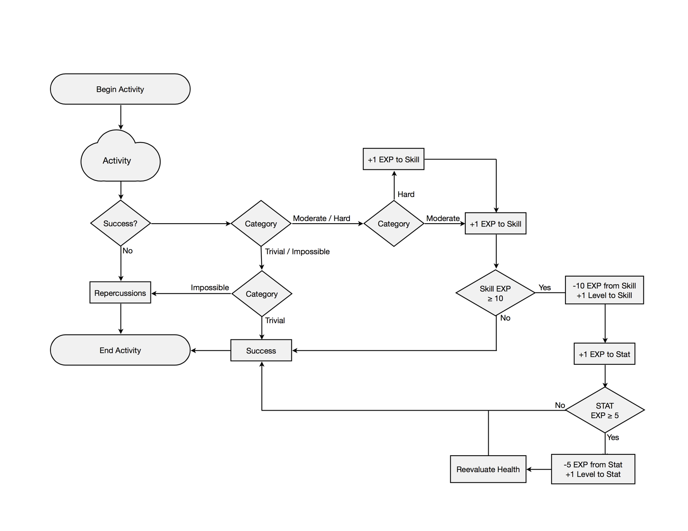

# Intro

## What is OMNE?
OMNE is a tool for creative table-top players who want to design and experience immersive worlds. The systems allows for the rapid production of everything from tools to races to mobs, with the goal that an entire world, complete with playable characters, can be devised within an afternoon.

## Why couldn’t I just use [GURPS](http://www.sjgames.com/gurps/) or re-skin D&D?
You can, if you’d like. Both systems bring something entirely different to the table that could possibly be what you’re looking for. However, re-skinning D&D can often be a tedious process, and because the system is designed to work with the D&D universe, often some of the crucial detail gets lost in translation. And unlike GURPS (which is also a system meant to support user-created worlds), OMNE’s approach is one of prototyping.

## How do I start?
A few simple things that you’re bound to have if you play tabletop RPGs.

### Materials
- Standard `d20` dice set
- Writing implement
- Character sheet
- GM-provided resources

Then, if you are planning on Game Mastering (GM’ing) your OMNE experience, stick around. The next few bits are important for coming up with your world, and making it fit the OMNE purview. If not, go ahead and jump to “How do I make a character?”, and start thinking about what you want to do in your GM’s world.

# GM Guide 

## Building Worlds 
## Creating Creatures 
## Instantiating Items 
## Defining Rituals 
## Creating and using Tags 

# Basics 

## How do I make a character? 
If you took the time to read [Creating Creatures](#creating_creatures), some of this intro might be redundant, but a little repetition never hurt anyone, right? So you want to know how to make a character; but before you can do that you need to know what a character consists of. In OMNE, like most other table-top systems, a character is addressed as a sum of several attributes (called “stats” in OMNE) and abilities (called “skills” in OMNE). The stats are a method of addressing the physical and mental capabilities inherent to a character, while the skills are a measurement of a character’s practiced capabilities.

In OMNE, the list of stats (known as an 8.2 stat system[1](#1_stat_system)) breaks down like this:

### Physical (PHYS)
|     Stat     |    Abbr.  | Definition                              |
|:------------:|:---------:|:----------------------------------------|
|   Strength   |    STRN   | Physical power                          |
|   Dexterity  |    DEXT   | Skill with prehensile appendages        |
|    Agility   |    AGIL   | Moving quickly and easily               |
|    Stamina   |    STAM   | Sustained physical effort               |
| *Visibility* |   *VSBL*  | *Visibility to the outside world*       |

### Mental (MNTL)
|     Stat     |    Abbr.  | Definition                              |
|:------------:|:---------:|:----------------------------------------|
|   Intellect  |    INTL   | Mental power                            |
|  Creativity  |    CRTV   | Generation of original ideas            |
|   Charisma   |    CHAR   | Social skills which inspire emotion     |
|     Zeal     |    ZEAL   | Mental fortitude, intuition, and belief |
| *Perception* |   *PRCP*  | *Awareness of surroundings*             |

  
Overall, these stats provide the basis for a character’s more specific skills, as well as their capacity for health and wellbeing. In OMNE, skills are not quite as succinct as stats. A skill is anything a being can attempt. Anything. Ever. Common skills for a D&D-style adventurer might include Dodge, Swordplay, Block, Lockpicking, and Tracking. Common skills for a 29th century robot might include Lasers, Mapping, Hacking, and Dodge. And common skills for a modern day chef might include Knifework, Chemistry, Nutrition, Culinary Artistry, and Bowling. In OMNE, skills are the primary way in which a character interacts with the world. Unlike in systems like D&D where skills are explicitly defined and separate from interactions like combat and magic, OMNE utilizes skills universally. But you’ll learn more about that later. Otherwise, that’s it. That’s the character (and basically the game). The next few bits are all about rolling dice and writing stories; the important (read: only) parts to actually making a character.

<small>
    1. The stat system is known as “8.2” (as opposed to “10” or some similar monicker) because 8 of the stats are active and meliorable. Changes in these stats reflect character growth. Contrariwise, 2 of the stats (*VSBL*, *PRCP*) are static and inherent. These stats are used primarily by the GM to tests a character’s natural effectiveness in certain passive activities, and changes to them reflect drastic or traumatic events.
</small>

## That’s cool and all, but you never told me how to make a character. 
Right, right. Now that you understand what a character is, you can start making one. The first thing to do is pick a race. Your GM did hand you a few races to chose from, right? No? Ok, well, it’s not big deal, we’ll just skip that part for now. The first thing to do is pick up a `d4`, with which you’ll be rolling values for stats. For each individual stat (10 of them) you’ll need to roll `d4-d4`. That means that your starting level for each stat will be somewhere between `-3` and `3`. Once you have 10 of these numbers, go ahead and assign each one to a stat (and if your GM has finally gotten around to give you some races, pick one and apply the necessary modifiers). Assuming you’re playing, say a Human, your stats should now look something like this:

|   PHYS   | Level |   MNTL   | Level |
|:--------:|------:|:--------:|------:|
|   STRN   |    -1 |   INTL   |     3 |
|   DEXT   |     0 |   CRTV   |     3 |
|   AGIL   |     2 |   CHAR   |     0 |
|   STAM   |    -1 |   ZEAL   |     1 |
|  *VSBL*  |     0 |  *PRCP*  |     1 |

  
Once you’ve done that, go ahead and calculate your Health Points (HP), using this equation:

|     Health Equation      |     Health Regeneration    |
|:------------------------:|:--------------------------:|
|   `(2 * STAM) + 20`      |       `ZEAL / hour`        |
| <small>minimum 1</small> |  <small>minimum 0</small>  |
|        &nbsp;            | <small>resting, x2</small> |

  
That equation is how you determine health through the game: ergo, if your STAM goes up by 1, your HP goes up by 2.

Next up, write a backstory. Make it as detailed or vague as you’d like. Cover a broad variety of pertinent factoids, or simply state your name and occupation. Keep in mind, however, that your GM will be using this to determine your starting skill set and skill levels. Then, hand off your character to your glorious leader. They will be responsible for determining what your character is initially capable of, to what capacity, and what tools they will have on hand. The GM does this by determining either (a) your character’s full skill set and initial levels, or (b) your characters full skill set and a pool of level points, from which you can distribute into your given skills. Note that this does not grant the GM omnipotency over your character. In OMNE, much of the game is determined not by endless tomes of rules, but by a few basic guidelines and the dialogue held between GM and party.

It should be safe to assume that, while you were reading that caveat, your GM finished their job, and you’re now ready to move on. What’s that? You have a few more questions? Ok, shoot.

## Does my character level?
Although the final say always comes down to player agreement, OMNE does not provide infrastructure for leveling. Instead, character advancement is handled by way of practicing skills, which in turn sharpens the character’s core stats. More on this later.

## Does my character have a class?
OMNE does not directly handle classes (opting instead for an “anyone-can-do- anything” philosophy), however classes can easily be built on top of OMNE by pre- determining a set of skills relevant to each class (as well as any bonuses, limitations, and weapon/armor capabilities seen relevant by the GM).

## Is there magic in OMNE?
That depends on your GM’s world. If you managed to drag yourself through [Defining Rituals](#defining_rituals), your’e already aware that OMNE has a loose, framework structure for supporting all forms of Magic, Spirituality, Science, etc. (basically anything less concrete than swords and stones). Most likely, if your world is one that takes advantage of these rituals, your character will make use of it by practicing skill-based invocations of rituals. For example, in a classic fantasy world, a character might have the skill “Magic Missile”, which fires several beams of arcane energy, doing damage. This skill would be used identically to any other skill, and it would be unlikely for you to have to rely on Magic Points, Spells per Day, or any other pool-based system in order to utilize a force. Rituals, like everything else in OMNE, are treated as skills.

## Does my character have a “to-hit”? Or an Armor Class? Or any perks?
Nope. As previously stated, most everything in OMNE is treaded as a skill. Ergo, your “to-hit” would just be something like a Swordplay check. Your Armor Class would be something like a Block or Dodge check. And if you’re looking for a perk that gives you berserker-like rage, you’d simply begin practicing Rage and Brawling skills.

## So... There’s no AC... No perks. No separate magic system. How do I do things?
Right. Good question. Skills.

## ... ... How do skills work?
As said, skills in OMNE are the primary way in which a character interacts with the world. Skills have a number (score) that measures a character’s capability in that skill. Any skill for any character begins at 0 (unless accounted for in a backstory). Skills also have corresponding stats, which reflect the relevant core abilities of the character. For example, the stat relevant to a typical Dodge skill would be AGIL, the stat for Lockpicking and Piano both DEXT, and so on.

## How do I use skills?
Alright, so this is the part where OMNE starts to get a little dense. and what better way to deal with that than flowcharts? The image below describes how you use skills, which is pretty massive considering the universality of OMNE skills. Here’s the overview: if your character wants to attempt something, they will make a skill check. That check will either be posed against a GM-determined Difficulty Check (DC), or an opposing skill check made by a competitor. This mechanic is used any time your character needs to actively interact, and will not change. Ready for that flowchart? No? Cool. Here you go.

<small>
So, that was probably miserably unclear. Sorry. As this document gets view by people who are maybe less technically inclined, this section will be used for further explanation. In the mean time, you totally (should) know how do everything in OMNE!
</small>

## Can I critically succeed with skills?
In OMNE, all critical outcomes are the result of an active role-play process. In this process, you must explicitly state your desired target (for example, an enemy’s heart). You then roll as per that awesome flowchart, like any generic skill check. If you succeed, your GM will then compare your roll against a DC to determine if you’ve critically succeeded. This number will usually by higher (possibly even prohibitively so), but failure to critically succeed has no bearing on overall success and experience.

## You never finished “Does my character level”.
Whoops, damn. No, your character does not level. Remember how OMNE deals with everything through skills? Yep, even this. Actually, there’s probably a flowchart around here somewhere. Nonetheless, “leveling” in OMNE is basically a process of getting better at, well, life. As you practice skills, all of your activities will fall into 1 of 4 categories:

|  Category  |     Roll Range    |
|:----------:|:-----------------:|
|   Trivial  |     `roll ≤ 1`    |
|  Moderate  |   `1 < roll ≤ 12` |
|    Hard    |  `12 < roll ≤ 20` |
| Impossible |    `roll > 20`    |

  
These categories are broken down by “roll range”. In order to determine roll range, you first need to figure out what number you need to get on your `d20` roll in order to succeed in a skill check.

To do this, calculate the minimum score you can get in your attempt (`STAT + SKILL + # SKILLS`), (where `# SKILLS` is the number of supporting skills you’re using). Then subtract this number from the `DC` (`DC-MIN`). This number is your roll range. An example? Sure:

> You: “I’m going to try and pick the lock”
>
> > *You then roll a `d20` (`15`), and add your DEXT (`0`) and Lockpicking (`3`).*
>
> > *Your total is `18`.*
>
>
> GM: “You succeed, the lock clicks open revealing...”
>
> > *The DC was `16`. Your minimum score was `DEXT + Lockpicking` (`3`).*
>
> > *`16 - 4 = 13`. `12 < 13 ≤ 20`. This lock was of hard difficulty.*
>
>
> GM: “You get 2 experience points in Lockpicking.”

And so as you succeed at moderate—hard tasks, you are exercising that skill, and therefore getting better. And as you get better at one stat-based skill, you get better at that overall stat. It’s all here in this flowchart.

## Is there anything else I should know before playing?
Yep, there are a few things. These things are still pretty fluid, and will find a better home than “Miscellaneous” by the final version of the booklet. Nevertheless, here they are:

- There will eventually be a point-buy system that can be used instead of the d4-d4 process in the near future.
- This document is currently in alpha, so please fork and make changes, participate in playtests, and generally help out as much as you'd like!